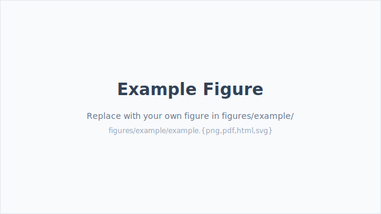

# Methods <!-- \label{sec:methods} -->

Methods are written in plain markdown with LaTeX pass-through for
anything complex — figures, tables, multi-line equations.

## Math

Inline math like $\text{Pr}(x \mid \theta)$ uses the `\prob` macro
defined in `templates/article.tex`. The `latex-builder preview` command
auto-expands such macros inside math when it emits the markdown-preview
blocks, so GitHub's KaTeX renders them too.

Display math:

$$
\log \frac{y_i}{1 - y_i} = \sum_j X_{ij} \beta_j + \alpha_i + \log \frac{\pi}{1 - \pi}
$$

Or, for fuller control, wrap in a ```latex block:

```latex
\begin{equation}\label{eq:bayes}
    \Pr(d \mid \mathcal{D}) = \frac{\Pr(\mathcal{D} \mid d)\,\Pr(d)}{\Pr(\mathcal{D})}
\end{equation}
```

<!-- latex-builder:preview:begin hash=390b9e1e -->
$$ \Pr(d \mid \mathcal{D}) = \frac{\Pr(\mathcal{D} \mid d)\,\Pr(d)}{\Pr(\mathcal{D})} $$
<!-- latex-builder:preview:end -->

Reference it with Equation \ref{eq:bayes}.

## Figures

Reference manifest-declared figures with `{{fig:id}}`:

```latex
\begin{figure}[h!]
    \centering
    {{fig:example}}
    \caption{Framework overview. Replace this image with your own by dropping
    a file into \texttt{src/VERSION/figures/example/example.png} (or .pdf, .html, .svg).}
    \label{fig:example}
\end{figure}
```

<!-- latex-builder:preview:begin hash=f4735a99 -->

<!-- latex-builder:preview:end -->

Or, for figures you won't reference from other places, inline an image:

```markdown

```

See [docs/figures.md](https://github.com/yakaboskic/latex-builder/blob/main/docs/figures.md)
for the full figure layout conventions.

## Tables

Simple tables — write them in native markdown:

| Condition | N    | Mean ± SD       |
|-----------|-----:|-----------------|
| Control   |  420 | 1.24 ± 0.18     |
| Treatment |  827 | 1.51 ± 0.22     |

The builder converts these to `\begin{tabular}` for LaTeX and
`<table class="md-table">` for HTML.

Complex tables (multi-column headers, `\cmidrule`, subtables) go in
```latex blocks:

```latex
\begin{table}[h]
\centering
\caption{Example complex table.}
\label{tab:example}
\begin{tabular}{@{}lrr@{}}
\toprule
Group & Count & Rate (\%) \\
\midrule
A     & 123   & 45.6 \\
B     & 456   & 78.9 \\
\bottomrule
\end{tabular}
\end{table}
```

<!-- latex-builder:preview:begin hash=e302bf19 -->
*(table — Example complex table.)*
<!-- latex-builder:preview:end -->

Reference the table above: Table \ref{tab:example}.
