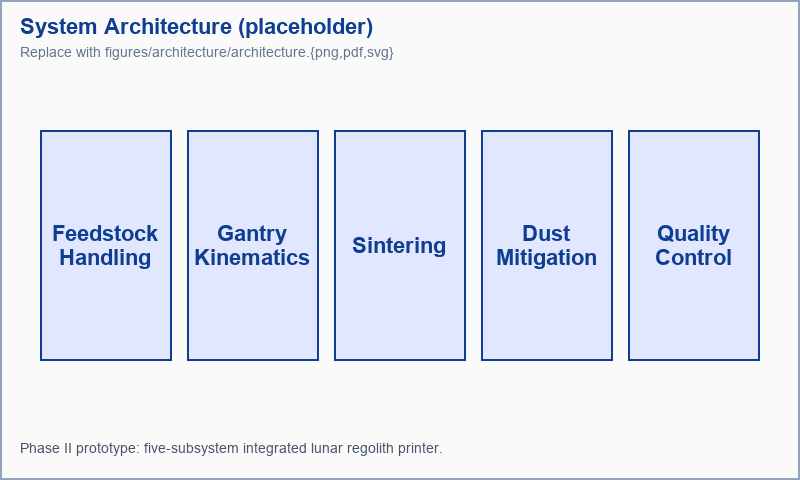

# 3.0 Technical Approach <!-- \label{sec:approach} -->

## 3.1 System Architecture

The Phase II prototype is a five-subsystem integrated printer.
Figure \ref{fig:architecture} shows the layout; descriptions of each
subsystem follow.

```latex
\begin{figure}[h!]
    \centering
    {{fig:architecture}}
    \caption{System architecture for the Phase II lunar regolith printer. Five
    interlocking subsystems — feedstock handling, gantry, sintering, dust
    mitigation, and quality control — deliver an autonomous print loop.}
    \label{fig:architecture}
\end{figure}
```

<!-- document-sanity:preview:begin hash=408f2bf4 -->

<!-- document-sanity:preview:end -->

**Feedstock handling**. A vibratory hopper meters JSC-1A simulant
into a heated buffer that drives off adsorbed water before the powder
reaches the print bed. Lunar-relevant grain size distributions
(median 70 µm, with 10% sub-20 µm fines) drive the hopper geometry.

**Gantry kinematics**. A three-axis CoreXY gantry positions the
sinter head over the {{PRINT_RESOLUTION_UM}} µm-resolution print bed.
The gantry is rated for thermal-vacuum operation and uses graphite
bushings rather than oil-lubricated bearings to survive the sub-Torr
environment.

**Sintering**. A 250 W diode laser delivers the focused thermal
input to the powder bed. The Phase I stepped profile is documented
in Aim 1; we extend that profile in Aim 2 for the vacuum-chamber gap.

**Dust mitigation**. The recoater is a blade-edge design with a
purge-gas knife (low-flow, recycled) that re-fluidizes settled fines.
This subsystem is the focus of Aim 2.

**Quality control**. An inline 8 µm thermal camera images each
layer post-sinter; layer-level features feed a small CNN classifier
trained against metallography ground truth. Aim 3 develops this
classifier.

## 3.2 Scientific Foundations

The approach builds on three demonstrated foundations:

1. **Solid-state sintering kinetics** for binary basaltic glass
   systems are well-characterized in the powder-metallurgy literature
   \cite{regolith_sinter_kinetics_2024}. Our Phase I profile leverages
   the iron-rich phase of JSC-1A as a sintering aid.

2. **Vacuum-compatible drive trains** at the scale of a desktop
   gantry have flight heritage from cubesat reaction wheel assemblies.

3. **Inline thermal-imaging defect detection** is a mature technique
   in industrial metal AM \cite{thermal_imaging_metal_am_2023}; we
   adapt the published feature pipeline rather than inventing a new
   one.

## 3.3 Key Technical Risks

| Risk | Likelihood | Impact | Mitigation |
|------|------------|--------|------------|
| Coupon strength <25 MPa in vacuum | Medium | High | Stepped profile (Aim 1); fall-back binder-jet path |
| Recoater binding on fines | High | Medium | Blade redesign + purge knife (Aim 2) |
| QC false-positive rate too high | Low | Low | Larger training set, ensemble classifier |

A more detailed five-row register lives in `tables/risk_register.tsv`
and is rendered below in Section 4.2.
